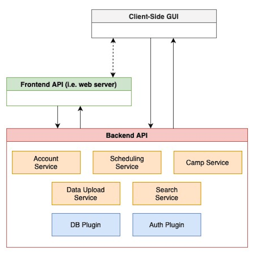

# YRES Scheduling Platform
> _Note:_ This document will evolve throughout your project. You commit regularly to this file while working on the project (especially edits/additions/deletions to the _Highlights_ section). 
 > **This document will serve as a master plan between your team, your partner and your TA.**

## Product Details
 
#### Q1: What is the product?

 > Short (1 - 2 min' read)
 * Start with a single sentence, high-level description of the product.
 * Be clear - Describe the problem you are solving in simple terms.
 * Specify if you have a partner and who they are.
 * Be concrete. For example:
    * What are you planning to build? Is it a website, mobile app, browser extension, command-line app, etc.?      
    * When describing the problem/need, give concrete examples of common use cases.
    * Assume your the reader knows nothing about the partner or the problem domain and provide the necessary context. 
 * Focus on *what* your product does, and avoid discussing *how* you're going to implement it.      
   For example: This is not the time or the place to talk about which programming language and/or framework you are planning to use.
 * **Feel free (and very much encouraged) to include useful diagrams, mock-ups and/or links**.

The product is a web application that generates summer camp schedules for students using an inputted floor plan and user data. We are working on this with York Region Education Services, through one part-time and one full-time employee. The problem they presented us with was that last summer they had a hard time creating a schedule for their summer camp and matching said schedule to each room. Our website aims to simplify this process by automatically generating a schedule through individually inputted users or a mass import. This schedule will include breaks for students. We will allow the user to modify their room or swap students Users can choose a floorplan associated with each campus. The schedule will be determined based on the student’s ages, then friendships, and students will be placed in groups of 15-20. There are also specialty rooms like the computer room that each group wants to use once a week preferably 2-3 times. This schedule will be displayed on our website for easy access. Our website will also have a login system as only camp counselors and coordinators are meant to have access. This will include an administrator, where the person who creates the camp is an administrator and administrators can make anyone else an administrator. We have a Figma file as a useful diagram.

#### Q2: Who are your target users?

  > Short (1 - 2 min' read max)
 * Be specific (e.g. a 'a third-year university student studying Computer Science' and not 'a student')
 * **Feel free to use personas. You can create your personas as part of this Markdown file, or add a link to an external site (for example, [Xtensio](https://xtensio.com/user-persona/)).**

The target users of our product are camp counselors and camp coordinators at YRES who need to make a schedule for their summer camp. They will be the ones that are responsible for inputting all the user data and generating the schedule. They will also use our product to make any modifications around rooms or student groups as they see fit. They will be able to view said schedule on our website. The indirect users are the students aged 5 to 12 attending said summer camp. They want a schedule that is based on their age and friendships. 

#### Q3: Why would your users choose your product? What are they using today to solve their problem/need?

> Short (1 - 2 min' read max)
 * We want you to "connect the dots" for us - Why does your product (as described in your answer to Q1) fits the needs of your users (as described in your answer to Q2)?
 * Explain the benefits of your product explicitly & clearly. For example:
    * Save users time (how and how much?)
    * Allow users to discover new information (which information? And, why couldn't they discover it before?)
    * Provide users with more accurate and/or informative data (what kind of data? Why is it useful to them?)
    * Does this application exist in another form? If so, how does your differ and provide value to the users?
    * How does this align with your partner's organization's values/mission/mandate?

Our product will greatly simplify the process of creating a schedule and make said schedule widely available for all target users. Our users will save time during the creation of their summer camp schedule because they don’t need to try and sort through the data manually and assign each student to a group based on various factors (which they currently do). The schedule generation will be accomplished instantly with our program. Modification is also easy and quick and most importantly so is the distribution which they currently have to do through email or messaging. Instead of having to re-send a newly modified schedule, they can discover any new changes on our website. Our schedule should also be more accurate than human schedule modification and creation. We will ensure all friendships are accounted for and ages are matched appropriately without any conflicts for rooms. Sought-after rooms will also be distributed fairly. Our product should align with our partner’s goal of creating fun and educational summer camps by improving the communication, accuracy, and speed of scheduling.

#### Q4: What are the user stories that make up the Minumum Viable Product (MVP)?

* As a user, I want to register an administrator account so that I can interact with the platform with a private user session. This account can be assigned to camps from which the user can manage scheduling, input data etc.
Acceptance Criteria: Given the inputted email address is not already registered and a valid password is provided, an administrator account will be registered and stored persistently. The user can log into this account given they provide the same email address and password combination that was submitted upon registration.

* As a user, I can upload a floor plan in order to create a basis for scheduling camps in a given location.
Acceptance Criteria:  Given the user is logged in and is uploading a floor plan of the proper file type, when the user attempts to upload the floor plan, ensure the floor plan is added to the list of available floor plans which can be scheduled on.

* As a user, I can block out certain rooms at certain times to schedule events for my camp.
Acceptance Criteria:  Given the user is logged in and has inputted all sufficient information for the scheduled event, when the user blocks out a given room, ensure this room can no longer be scheduled at the given time period by other users.

* As a user, I can use the generated class lists to generate a weekly camp schedule for a specific floor plan. This camp schedule should tell me which class should be in which room, and the time slot in which they are scheduled there.
Acceptance Criteria:  Given the user is logged in and the floor plan has been uploaded, when the user attempts to generate a schedule, they should be shown a timetable of classes and their respective locations.

* As a user, I can input counselor and student names/gender/ages/group data in order to add them to the camp. 
Acceptance Criteria: Given the user is logged in, and student/counselor fields are filled in properly, when the user adds the counselor/student, then the student/counsellor will be added to the database.

* As a user, I can receive automatically generated class lists of two counselors and 20 students.

#### Q5: Have you decided on how you will build it? Share what you know now or tell us the options you are considering.

We will be building the YRES scheduling web application on a [Node.JS 18.8](https://nodejs.org/en) software stack. The backend logic will be managed by a single [RESTful API](https://restfulapi.net) which will be implemented using the [Express.JS framework](https://expressjs.com). We will use a [PostgreSQL 15.4](https://www.postgresql.org/about/news/postgresql-15-released-2526/) database server to handle persistent storage. We are considering the use of [Elasticsearch](https://www.elastic.co) to handle search operations, although we will focus on achieving the MVP using only DB requests due to paid licensing concerns.

The frontend will be handled in an independent RESTful API which will be implemented using the Express.JS framework. The user interface will be designed using [React.JS](https://react.dev), while the frontend API will function as a web server to render and serve client-side resources. The frontend API will query the backend API to incorporate relevant data into the rendered pages. Some backend API requests may be made directly from the client-side javascript (via [AJAX](https://developer.mozilla.org/en-US/docs/Web/Guide/AJAX) requests).

> *Higher-level Design Diagram (N.B. More detailed architecture schematic will be provided for D2)*

The database server, frontend API and the backend API will be containerized using [Docker](https://www.docker.com). These containers will then be orchestrated using [Docker networks](https://docs.docker.com/network/) for ease of deployment. This is important as we may not have access to a production environment during the early stages of development and we wish to ensure the software is supported across common environments/operating systems.

We will pursue a “CLEAN service-based” architecture for both the frontend and backend APIs. This will differ slightly from the standard [CLEAN architecture](https://blog.cleancoder.com/uncle-bob/2012/08/13/the-clean-architecture.html) learned in CSC207 by dividing the application business rules by service-based modules rather than use cases. Each service-based module will group functions implementing the logic for related requests (e.g. an “Account Service” that implements use cases for login, logout, register etc). This, we believe, will reduce duplication of code and will streamline the development of the project by allowing developers to focus on implementing independent services. The forward dependency rule will be adhered to via dependency inversion where necessary. Each service will consist of a router module, a controller module (acting as both controller and presenter) and a service use cases module, belonging to the respective hierarchal layers in the CLEAN architecture. 

----
## Intellectual Property Confidentiality Agreement 
> Note this section is **not marked** but must be completed briefly if you have a partner. If you have any questions, please ask on Piazza.
>  
**By default, you own any work that you do as part of your coursework.** However, some partners may want you to keep the project confidential after the course is complete. As part of your first deliverable, you should discuss and agree upon an option with your partner. Examples include:
1. You can share the software and the code freely with anyone with or without a license, regardless of domain, for any use.
2. You can upload the code to GitHub or other similar publicly available domains.
3. You will only share the code under an open-source license with the partner but agree to not distribute it in any way to any other entity or individual. 
4. You will share the code under an open-source license and distribute it as you wish but only the partner can access the system deployed during the course.
5. You will only reference the work you did in your resume, interviews, etc. You agree to not share the code or software in any capacity with anyone unless your partner has agreed to it.

**Your partner cannot ask you to sign any legal agreements or documents pertaining to non-disclosure, confidentiality, IP ownership, etc.**

Briefly describe which option you have agreed to.

----

## Teamwork Details

#### Q6: Have you met with your team?

Do a team-building activity in-person or online. This can be playing an online game, meeting for bubble tea, lunch, or any other activity you all enjoy.
* Get to know each other on a more personal level.
* Provide a few sentences on what you did and share a picture or other evidence of your team building activity.
* Share at least three fun facts from members of you team (total not 3 for each member).

#### Q7: What are the roles & responsibilities on the team?

Max Xu: Max is working as a frontend developer They volunteered for the role due to their previous experience working with frontend technologies and being interested in learning more.

Ewan Jordan: Ewan is working as a frontend developer, as well as the product manager/partner liaison. They are responsible for maintaining communication with the partner and keeping track of minutes during meetings as product manager. They volunteered for the role of product manager due to their strong organization and communication skills and as frontend developer due to their previous experience working with frontend technologies and being interested in learning more.

Gabriel Anover: Gabriel is working as a frontend developer. They volunteered for the role due to their previous experience working with frontend technologies in a professional setting and being interested in learning more.

Peifeng Zhang: Peifeng is working as a backend developer. They volunteered for the role due to their previous experience working with backend technologies and being interested in learning more.

Marc Grigoriu: Marc is working as a backend developer. They volunteered for the role due to their previous experience working with backend technologies and being interested in learning more.

Eric Karpovits: Eric is working as a backend developer, as well as team lead. They are additionally responsible for developing software interacting with databases as backend developer, and are responsible for creating agendas for team/partner meetings and watching over progress on the project. They volunteered for the role of team lead and as backend developer due to their previous experience working with backend technologies in a professional setting and being interested in learning more.

Harvey Donnelly: Harvey is working as a backend developer, as well as development manager. As development manager, they are responsible for making decisions regarding the structure of the project and making sure software being written works as intended. They volunteered for the role of development manager due to their work experience and their knowledge of how projects like these are structured, and as backend developer due to their previous experience working with backend technologies in a professional setting and being interested in learning more.

#### Q8: How will you work as a team?

Our team plans to hold two recurring meetings a week, one including our partner and one with just the team. The team meetings occur at 8:10PM online on Thursday evenings (before our tutorial time slot), and run until 9:15PM. These meetings are a chance for team members to share what they’ve completed over the past week, as well as outline upcoming tasks and goals that they’re working towards. These meetings are also crucial in the divide of both short term and long term workload. Our meetings with our partner are currently scheduled for 5:30PM-6:30PM on Friday afternoons. During this hour, we plan to ask questions we’ve gathered over the week concerning the partner-side of the project, as well as share our progress with the partner as to show we are on track. 

In addition to these conversational meetings, we plan to hold weekly/biweekly coding sessions, where available group members will meet in a study room and work on their respective tasks together. We plan for these sessions to not necessarily include the entire group; if a given section of the codebase has multiple people working in conjunction on it, these group members could organize a code session for them to share ideas and collaborate.

In our first meeting with our partner, Celina initially went over the project proposal with us to smooth out any queries we had regarding their needs. She outlined what aspects of camp scheduling is already set up by their organization, i.e. student registration, camp set up, etc. We then showcased our initial MVP prototype and got feedback. Then, we went over questions we had regarding functionality of the project. These questions helped fill in the gaps we had with our initial prototype(see the minutes for specific questions).

In our second meeting with our partner, we began by sharing our updated prototype and confirming our updated user stories which were built off of the partner’s proposal. The partner was pleased with our prototype and user stories, and provided us with some new information for the director, which eliminated some use cases. We followed that with a Q&A of questions we had compiled over the last week. We also added our partner to our GitHub, created a group chat with our main contact for smaller questions, and received a logo set/colour pallet for the project.

  
#### Q9: How will you organize your team?
We will make use of the industry standard Jira Software, leveraging all its tools. 

It will allow us:
* Have our related tickets/issues in an “Epic” 
* Have a general timeline and schedule of the project using the “Timeline”
* Determine the status of the work throughout the process using the “Kanban Board”
* Allow team members to freely choose their next preferred ticket based on their dev role
* Have ticket requirements
* Prioritize tasks 
* We will also produce meeting minutes and store them in the GitHub

#### Q10: What are the rules regarding how your team works?

**Communications:**
 * What is the expected frequency? What methods/channels will be used? 
 * If you have a partner project, what is your process for communicating with your partner?
 
**Collaboration: (Share your responses to Q8 & Q9 from A1)**
 * How are people held accountable for attending meetings, completing action items? Is there a moderator or process?
 * How will you address the issue if one person doesn't contribute or is not responsive?

Communications:
Communication between team members will be held mainly through a Discord server where members can communicate with each other at any time, on top of weekly scheduled group meetings held on Google Meet and the Zoom sessions held during the tutorial section on thursdays. Meetings on Google Meet will be held on Thursday afternoons starting at 8:10 PM. Additionally, communication is maintained by the product manager with our partner through email, as well as through weekly scheduled meetings held on fridays through Zoom from 5:30 PM - 6:30 PM.

Collaboration:
Members of the team are expected to attend weekly meetings scheduled ahead of time and complete action items as they are assigned, or to at least give the rest of them team a warning if there is an issue that inhibits their ability to do so. There is no moderator in particular, however if someone is unable to join a meeting then the minutes would be shared with them online in order to catch them up. If the situation arises where someone is becoming unresponsive online and/or not contributing to the project, the rest of the team would try to communicate with them directly to find out what the issue is and if they could use some assistance re-engaging with the development process.

