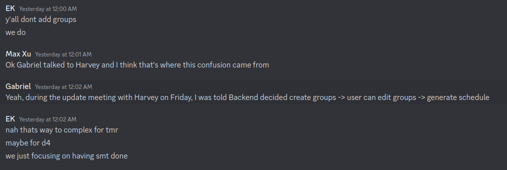
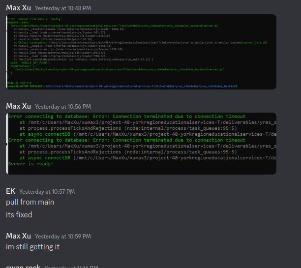

# 48 YRES (York Regional Educational Services) 

## Iteration 3 - Review & Retrospect

 * When: Thursday November 16, 2023
 * Where: Online

## Process - Reflection

#### Q1. What worked well

List **process-related** (i.e. team organization and how you work) decisions and actions that worked well.

 * 2 - 4 important decisions, processes, actions, or anything else that worked well for you, ordered from most to least important.
 * Give a supporting argument about what makes you think that way.
 * Feel free to refer/link to process artifact(s).

1. The Frontend development process went smoothly when indpendent of backend. Frontend completed task at a good pace and we developed a UI our partner was happy with. The Frontend had a minimal viable product ready early and didn't face issues until integration.

2. We leverage Github Workflows for continuous integration tests, employing four primary automation workflows. These encompass CI for the backend, CD for the backend, CI/CD for the database, and CI/CD for the frontend—all seamlessly integrated onto an EC2 instance. These workflows are triggered by various actions such as pull requests, pushes/merges to the main branch, or specific file alterations.
 * This streamlined approach ensures effortless and automated deployment, maintaining a continuously operational main version while validating every build before integration into the main branch. This not only simplifies deployment but also guarantees a stable and reliable codebase at all times and a single version of a database that everyone can work with. [GitHub Actions](https://github.com/csc301-2023-fall/project-48-yorkregioneducationalservices-T/actions?page=2)

3. The Schema Design was generally good and di not require significant changes over the course of development. Most significantly, an intermediary table was created to outline a many to many relationship between Room and Activity, and some (on delete) behaviours were implemented for some tables.

   

#### Q2. What did not work well

List **process-related** (i.e. team organization and how you work) decisions and actions that did not work well.

 * 2 - 4 important decisions, processes, actions, or anything else that did not work well for you, ordered from most to least important.
 * Give a supporting argument about what makes you think that way.
 * Feel free to refer/link to process artifact(s).

The biggest thing we did not do well on was communication. Throughout most of development, the frontend and backend teams worked fairly independently without talking with each other very much. While working in smaller teams helped each sub group organize themselves better, the lack of communication meant there were many occasions where either frontend or backend had unclear expectations for how a workflow or entity worked according to the other team. This became especially obvious when integrating with the backend. The frontend team needed to modify many entities and change how the UI works in order for the backend to integrate comfortably. If both sub teams communicated better with each other, we would have avoided a lot of the confusion when it came time to merge both halves together.

<figure>
  
  <figcaption>
    <em>Miscommunication in communication</em>
  </figcaption>
</figure>

Another thing that did not work well for us was we failed to make our app very portable. While we were able to get CI/CD working, getting the full app with frontend, backend, and DB on each of our local machines did not work well. This led to us using the deployed DB for testing and running the frontend and backend servers on each of our devices. This lack of isolation in testing lead to many instances where changes to the DB lead to errors on our local testing instances. This made us spend a considerable amount of time debugging to make sure our own local testing instances worked rather than ensuring features work.

<figure>
  
  <figcaption>
    <em>Trying to get our builds to work</em>
  </figcaption>
</figure>

#### Q3(a). Planned changes

 * Communication: We plan to integrate our communication between the frontend and the backend, as having it completely sperate made code integration much more difficult. For example, api calls were being ogranized with out any frontend having any knowledge of their form. This led to a very sloppy integration of the two, and a last of last minute hustle to resolve bugs.
 * Goal Organization: We plan to create a more robust shortterm planning routine with list of at least 5 goals to be completed in the upcoming 3 days. There were often stretches of a couple days where the team felt as though we didnt really have much to work on, when in reality we just hadn't set enough goals for ourselves.
 * Code Organization: We plan to rework the organization of the backend/database as currently it is a bit confusing and difficult to integrate with. 
#### Q3(b). Integration & Next steps 

 We integrated the individual components through three seperate pull requests into the main repo. We felt as though the assignment led to a bit of fragmentation within the organization of code, as everything was built almost completely disjoint of eachother.

## Product - Review

#### Q4. How was your product demo?
 * How did you prepare your demo?
    To prepare for our demo, as we planned on doing backend integration last, we anticipated not being able to have a fully functional app to demonstrate. However, we did want our partner to see all the workflows of the app. As a result, we worked to make sure the frontend was complete with all the workflows the app was supposed to have. This preparation would also help us focus our efforts into developing and integrating the backend.
 * What did you manage to demo to your partner?
    We were able to successfully demonstrate a finished frontend with the partner. This was done via a Zoom share screen. While there was only limited interactivity as a result, the fact that the frontend was finished meant the partner could see and comment on the main workflows we had.
 * Did your partner accept the features? And were there change requests?
    The partner commented that they were happy with the features and did not request any changes. They did however, take photos of our presentation and would get back to us depending on how other members in the partner organization felt. They have yet to make any replies.
 * What were your learnings through this process? This can be either from a process and/or product perspective.
 * *This section will be marked very leniently so keep it brief and just make sure the points are addressed*
